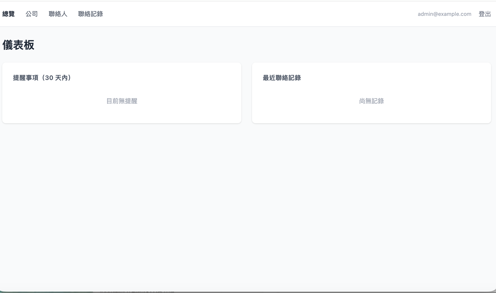

# Lite CRM

輕量 B2B 客戶關係管理系統。設計給需要追蹤客戶往來、管理聯絡窗口、記錄每次互動的業務人員使用。

→ **[快速起步](docs/quickstart.md)**

## 誰應該用這個產品？

Lite CRM 適合 **3-15 人的小團隊**，特別是：
- 銷售部門跟進客戶往來
- 業務代理公司管理聯絡窗口
- 創業團隊追蹤客戶進度
- 現在用 Excel + 共享雲端管客戶的團隊

**如果你需要**權限控制、多租戶隔離、複雜工作流，Lite CRM 不適合你。

## 設計哲學

Lite CRM 為小團隊設計，採取**完全透明的數據模型**：

- **團隊成員共享同一份客戶數據庫** — 所有人看到相同的公司、聯絡人、興趣標籤
- **沒有角色或權限區分** — 所有登入用戶都有相同的操作權限（新增、編輯、刪除）
- **每次聯絡記錄操作者** — 系統追蹤誰最後跟進了哪個客户

這是有意選擇，不是技術限制：

✓ **減少複雜性** — 沒有「你沒權限看這個」或「你不能編輯這個」的問題  
✓ **提升透明度** — 團隊成員互相看得到誰在跟進什麼，減少客户被漏掉或重複聯絡  
✓ **簡化運維** — 不需要權限審批、角色管理、權限衝突排解  
✗ **無法隔離信息** — 所有人都能看到並編輯所有資料，不適合需要保護敏感客户的場景

## 功能



完整功能說明和視覺展示，詳見 **[功能介紹](docs/features.md)**：

- **公司管理** — 公司列表、多維度篩選、CSV 批次匯入
- **聯絡人管理** — 聯絡人資料庫、vCard 匯出、跨公司搜尋
- **聯絡記錄** — 流水帳記錄、多條件篩選、置頂標記
- **興趣標籤** — 標記興趣項目、附加提醒日期、儀表板到期提醒

## 技術架構

- **後端**：Clojure + [Reitit](https://github.com/metosin/reitit)，server-side rendering
- **資料庫**：SQLite + [HoneySQL](https://github.com/seancorfield/honeysql)，連線池用 HikariCP
- **前端**：[HTMX](https://htmx.org/) + [Alpine.js](https://alpinejs.dev/)，無需 build step
- **CSS**：TailwindCSS（dev 模式自動 watch）
- **系統生命週期**：[Integrant](https://github.com/weavejester/integrant)
- **認證**：Buddy session-based auth，含 CSRF 防護

## 開發

安裝 Java、Clojure、Babashka、TailwindCSS（或透過 [mise](https://mise.jdx.dev/)）：

```shell
mise trust && mise install
```

查看所有可用指令：

```shell
bb tasks
```

啟動 REPL 與伺服器：

```shell
bb clj-repl
# 進入 REPL 後：
(reset)
```

伺服器預設在 `http://localhost:8000`，程式碼修改後自動 reload。

## 常用指令

```shell
bb clj-repl   # 啟動 REPL（執行 (reset) 啟動系統）
bb test       # 執行所有測試
bb check      # fmt + lint + outdated + tests
bb fmt        # 自動修正格式（cljfmt）
bb lint       # 執行 clj-kondo
bb css-watch  # 監聽並重新編譯 TailwindCSS
bb build      # 建立 production uberjar
```

## 更新前端資源

JS 資源（HTMX、Alpine.js）直接 vendor 在專案中，不需要 JS build step。要更新版本：編輯 `bb.edn` 中的 `fetch-assets` 區段，再執行：

```shell
bb fetch-assets
```

資源會更新至 `resources/public/` 目錄。

## 測試

整合測試，對真實 SQLite 執行完整 HTTP 請求。每個測試使用 `integrant-extras/with-system` fixture 啟動完整系統，每個 test case 用 `with-truncated-tables` 清除資料：

```shell
bb test
```

## 部署

→ **[部署指南](docs/deployment.md)**（環境變數設定、systemd 服務、DB 備份、升級流程）

## 作者

[Laurence Chen](https://replware.dev)

技術棧採用 [Clojure Stack Lite](https://stack.bogoyavlensky.com/)。
