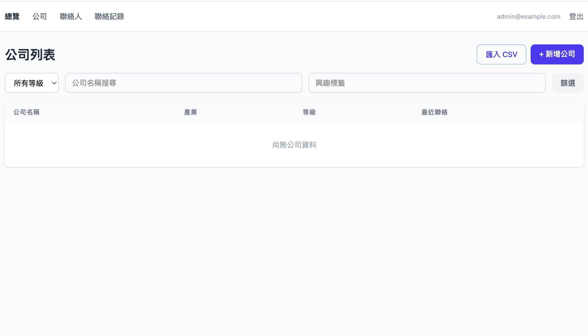
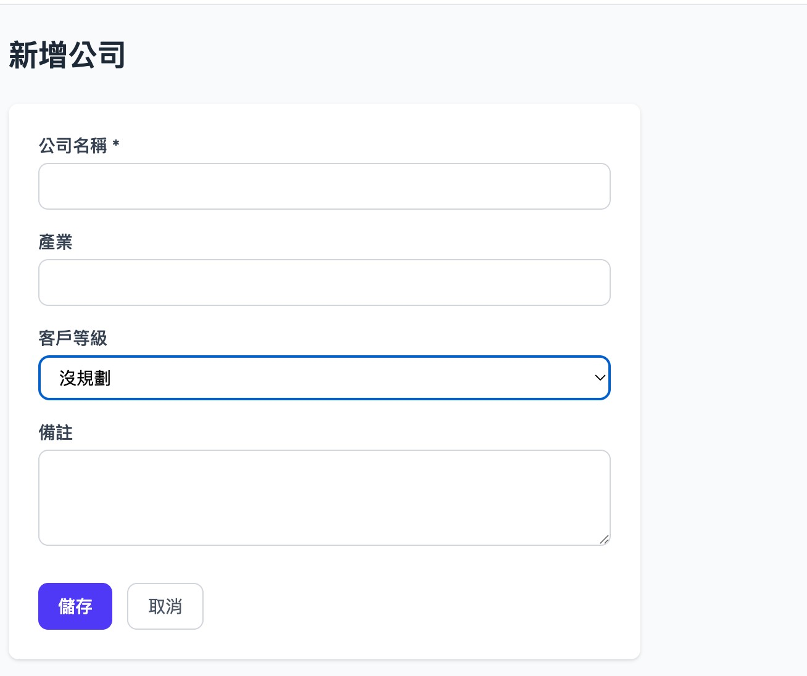
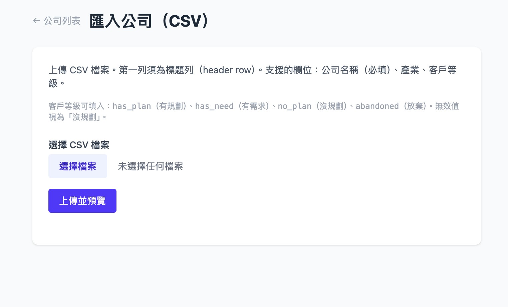
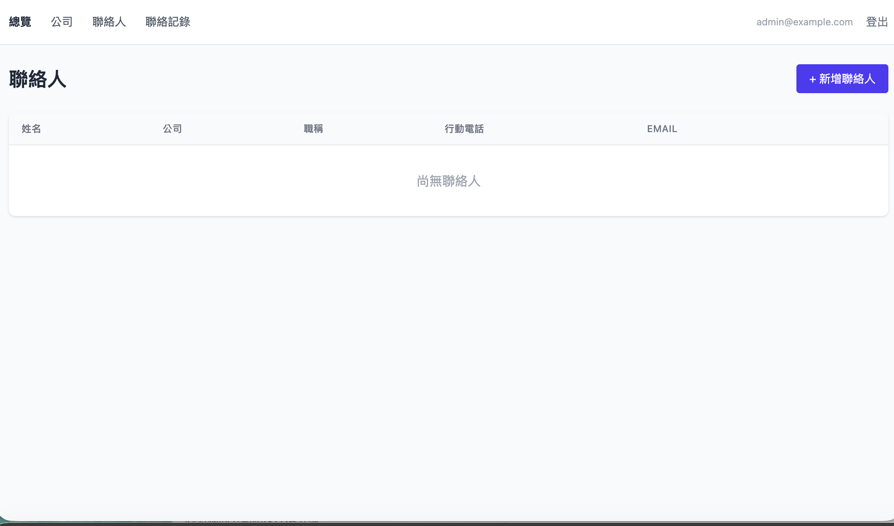
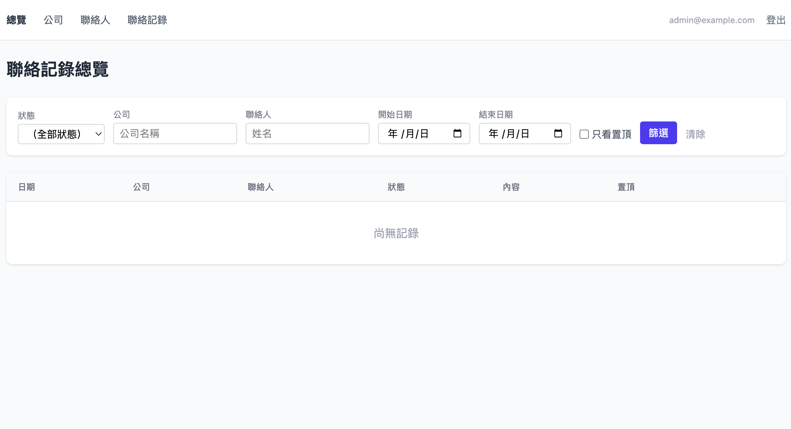

# Lite CRM 功能展示

## 儀表板

儀表板是你每次登入時的首頁，展示需要追蹤的重要資訊：

- **提醒事項**（30 天內）— 標籤到期前的提醒，方便你掌握即將跟進的客戶
- **最近聯絡記錄** — 快速回顧團隊最近的互動紀錄

## 公司管理

### 公司列表

查看、搜尋和篩選所有公司資料。支援多種篩選條件：

- **等級篩選** — 有規劃、有需求、沒規劃、放棄
- **名稱搜尋** — 即時搜尋公司名稱
- **興趣標籤篩選** — 按興趣項目找到特定公司
- **CSV 批次匯入** — 大量上傳公司資料（自動略過重複名稱）

### 新增公司

填寫公司基本資訊，建立新的客戶記錄：

- **公司名稱**（必填）
- **產業** — 自由填寫
- **客戶等級** — 有規劃 / 有需求 / 沒規劃 / 放棄
- **備註** — 記錄任何額外資訊

### CSV 批次匯入

快速匯入大量公司資料。上傳後會顯示預覽，確認無誤後才進行匯入：

- 第一列為表頭（header row）
- 必填欄位：公司名稱
- 選填欄位：產業、客戶等級
- 客戶等級可填入：`has_plan`（有規劃）、`has_need`（有需求）、`no_plan`（沒規劃）、`abandoned`（放棄）
- 無效值預設為「沒規劃」

## 聯絡人管理

完整的聯絡人資料庫，支援跨公司搜尋和管理：

- **姓名、職稱、部門** — 組織聯絡人資訊
- **電話 / 分機** — 座機和分機號碼
- **行動電話** — 手機號碼
- **Email** — 電子郵件地址
- **公司關聯** — 聯絡人可以在公司間移動
- **vCard 匯出** — 下載 `.vcf` 檔案，可直接匯入手機通訊錄

## 聯絡記錄

記錄每一次與客戶的互動。全域記錄台提供完整的聯絡歷史查詢：

### 聯絡記錄台

- **狀態篩選** — 未接、接通沒談、寄送自介信、已簽合約等
- **公司篩選** — 特定公司的所有聯絡記錄
- **聯絡人篩選** — 特定人員的聯絡記錄
- **日期範圍** — 按時間段查詢
- **只看置頂** — 快速找出重要記錄
- **多窗口記錄** — 同一次聯絡可以關聯多個聯絡窗口

## 興趣標籤

為公司或聯絡人標記興趣項目，並設定提醒日期：

- 靈活建立興趣標籤（例如：MDS、某產品線、特定專案）
- 附加提醒日期，到期提醒顯示在儀表板
- 幫助團隊掌握重點客戶的跟進機會
